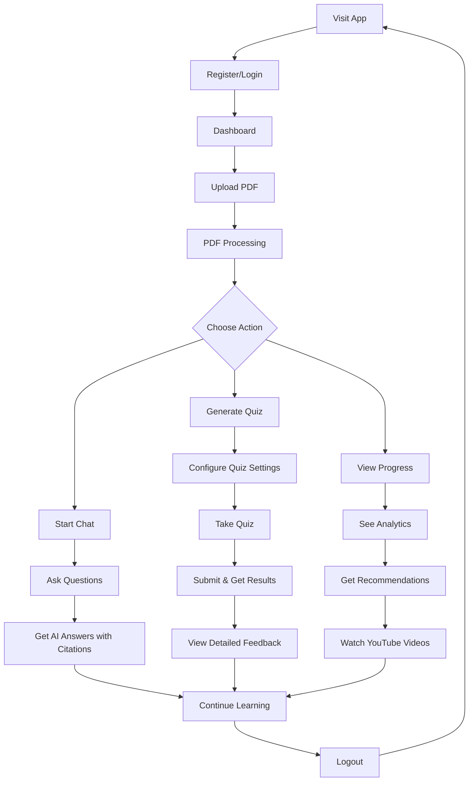

# 🎬 Study Buddy - Complete Demo Guide

## 📖 How the Project Works - A Complete Walkthrough

This guide demonstrates the entire user journey through the Study Buddy application, from registration to logout, showcasing all major features.

---

## 🗺️ Table of Contents

1. [Registration & Login](#1-registration--login)
2. [Dashboard Overview](#2-dashboard-overview)
3. [PDF Upload & Management](#3-pdf-upload--management)
4. [AI Chat System](#4-ai-chat-system)
5. [Quiz Generation & Taking](#5-quiz-generation--taking)
6. [Progress Tracking](#6-progress-tracking)
7. [YouTube Recommendations](#7-youtube-recommendations)
8. [User Profile & Settings](#8-user-profile--settings)
9. [Logout](#9-logout)

---

## 1. Registration & Login

### **Step 1.1: Landing Page**

**URL**: `http://localhost:3000` or `https://your-app.vercel.app`

**What You See**:
```
┌─────────────────────────────────────────┐
│      📚 Study Buddy                     │
│   AI-Powered Learning Platform          │
│                                         │
│   ┌─────────┐  ┌─────────┐            │
│   │  Login  │  │Register │            │
│   └─────────┘  └─────────┘            │
│                                         │
│   Transform your PDFs into             │
│   interactive study materials          │
└─────────────────────────────────────────┘
```

**Action**: Click **"Register"** button

---

### **Step 1.2: Registration Form**

**What You See**:
```
┌──────────────────────────────────────┐
│   Create Your Account                │
│                                      │
│   Username: [__________________]     │
│   Email:    [__________________]     │
│   Name:     [__________________]     │
│   Grade:    [Select Grade ▼   ]     │
│   Password: [__________________]     │
│   Confirm:  [__________________]     │
│                                      │
│   [Register Account]                 │
│                                      │
│   Already have an account? Login    │
└──────────────────────────────────────┘
```

**Fill In**:
- **Username**: `john_student`
- **Email**: `john@example.com`
- **Name**: `John Doe`
- **Grade**: `Grade 12`
- **Password**: `secure123` (minimum 6 characters)
- **Confirm Password**: `secure123`

**What Happens**:
1. Form validates input (checks email format, password length)
2. Sends POST request to `/api/auth/register`
3. Backend creates user in MongoDB
4. JWT token generated and stored (cookie + localStorage)
5. Redirects to dashboard

**Success Message**: 
```
✅ Account created successfully!
```

---

### **Step 1.3: Login (For Returning Users)**

**What You See**:
```
┌──────────────────────────────────────┐
│   Welcome Back!                      │
│                                      │
│   Email:    [__________________]     │
│   Password: [__________________]     │
│                                      │
│   [ ] Remember me                    │
│                                      │
│   [Login]                            │
│                                      │
│   Don't have an account? Register   │
└──────────────────────────────────────┘
```

**Fill In**:
- **Email**: `john@example.com`
- **Password**: `secure123`

**What Happens**:
1. Validates credentials
2. Sends POST request to `/api/auth/login`
3. Backend verifies password (bcrypt comparison)
4. JWT token generated
5. Redirects to dashboard

**Success Message**:
```
✅ Login successful!
```

---

## 2. Dashboard Overview

### **Step 2.1: First View**

**URL**: `http://localhost:3000/dashboard`

**What You See**:
```
┌────────────────────────────────────────────────────────┐
│  Study Buddy    Dashboard | PDFs | Chat | Quiz | Progress │
│  👤 John Doe                                 [Logout]     │
└────────────────────────────────────────────────────────┘
┌────────────────────────────────────────────────────────┐
│  📊 Welcome back, John!                                │
│                                                        │
│  ┌──────────┐  ┌──────────┐  ┌──────────┐           │
│  │   📄     │  │   💬     │  │   📝     │           │
│  │  PDFs    │  │  Chats   │  │ Quizzes  │           │
│  │    0     │  │    0     │  │    0     │           │
│  └──────────┘  └──────────┘  └──────────┘           │
│                                                        │
│  📈 Recent Activity                                    │
│  ├─ No activity yet                                   │
│  └─ Upload a PDF to get started!                     │
│                                                        │
│  🎯 Quick Actions                                      │
│  ├─ [Upload PDF]                                      │
│  ├─ [Start Chat]                                      │
│  └─ [Generate Quiz]                                   │
└────────────────────────────────────────────────────────┘
```

**Dashboard Features**:
- **Stats Cards**: Shows count of PDFs, Chats, Quizzes
- **Recent Activity**: Latest actions and updates
- **Quick Actions**: Shortcuts to main features
- **Progress Overview**: Learning statistics

---

## 3. PDF Upload & Management

### **Step 3.1: Navigate to PDF Manager**

**Action**: Click **"PDFs"** in navigation bar

**URL**: `http://localhost:3000/pdfs`

---

### **Step 3.2: Upload Your First PDF**

**What You See**:
```
┌────────────────────────────────────────────────────────┐
│  📚 PDF Manager                          [Upload PDF]  │
└────────────────────────────────────────────────────────┘
┌────────────────────────────────────────────────────────┐
│                                                        │
│           📄                                           │
│     No PDFs uploaded yet                              │
│                                                        │
│  Upload your study materials to get started           │
│                                                        │
│          [Choose File to Upload]                      │
│                                                        │
│  Supported: PDF files (max 10MB)                     │
└────────────────────────────────────────────────────────┘
```

**Action**: Click **"Upload PDF"** or **"Choose File"**

**File Selection Dialog**:
```
┌────────────────────────────────────────┐
│  Select PDF File                       │
│                                        │
│  📁 Documents/                         │
│    📄 Physics_Chapter1.pdf             │
│    📄 Math_Algebra.pdf                 │
│    📄 Biology_CellStructure.pdf        │
│                                        │
│         [Open]    [Cancel]             │
└────────────────────────────────────────┘
```

**Select**: `Physics_Chapter1.pdf` (8.2 MB)

---

### **Step 3.3: Upload Progress**

**What Happens**:
```
┌────────────────────────────────────────┐
│  Uploading Physics_Chapter1.pdf       │
│                                        │
│  ███████████████░░░░░░░░░░ 65%        │
│                                        │
│  Uploading to cloud...                │
└────────────────────────────────────────┘
```

**Backend Process**:
1. **Upload to S3**: File sent to AWS S3 bucket
2. **Text Extraction**: `pdf-parse` extracts content
3. **Chunking**: Text split into 500-char chunks
4. **Embeddings**: Each chunk vectorized using Gemini
5. **Database**: Metadata saved to MongoDB

**Processing Steps**:
```
✓ File uploaded to S3
✓ Text extracted (25 pages, 12,450 words)
✓ Created 48 chunks
✓ Generated embeddings
✓ Saved to database
```

**Success**:
```
✅ Physics_Chapter1.pdf uploaded successfully!
```

---

### **Step 3.4: View Uploaded PDFs**

**What You See**:
```
┌────────────────────────────────────────────────────────┐
│  📚 My PDFs (1)                          [Upload PDF]  │
└────────────────────────────────────────────────────────┘
┌────────────────────────────────────────────────────────┐
│  ┌──────────────────────────────────────────────────┐ │
│  │ 📄 Physics_Chapter1.pdf                          │ │
│  │                                                  │ │
│  │ Title: Newton's Laws of Motion                  │ │
│  │ Pages: 25  |  Size: 8.2 MB  |  Subject: Physics│ │
│  │ Uploaded: 2 minutes ago                         │ │
│  │                                                  │ │
│  │ [View] [Chat] [Quiz] [Delete]                  │ │
│  └──────────────────────────────────────────────────┘ │
└────────────────────────────────────────────────────────┘
```

**PDF Card Features**:
- **Title**: Extracted from PDF metadata
- **Stats**: Page count, file size, subject
- **Actions**:
  - **View**: Preview PDF
  - **Chat**: Start AI chat about this PDF
  - **Quiz**: Generate quiz from this PDF
  - **Delete**: Remove PDF

---

### **Step 3.5: PDF Preview**

**Action**: Click **"View"** button

**What You See**:
```
┌────────────────────────────────────────────────────────┐
│  Physics_Chapter1.pdf                        [Close]   │
└────────────────────────────────────────────────────────┘
┌────────────────────────────────────────────────────────┐
│  Page 1 of 25                         [◄] [1] [►]     │
├────────────────────────────────────────────────────────┤
│                                                        │
│         CHAPTER 1: NEWTON'S LAWS OF MOTION            │
│                                                        │
│  1.1 Introduction                                     │
│                                                        │
│  Newton's laws of motion are three fundamental        │
│  laws that describe the relationship between the      │
│  motion of an object and the forces acting on it...   │
│                                                        │
└────────────────────────────────────────────────────────┘
```

---

## 4. AI Chat System

### **Step 4.1: Start New Chat**

**Action**: Click **"Chat"** in navigation

**URL**: `http://localhost:3000/chat`

**What You See**:
```
┌────────────────────────────────────────────────────────┐
│  💬 AI Chat                                            │
└────────────────────────────────────────────────────────┘
┌──────────┬─────────────────────────────────────────────┐
│ Chats    │                                             │
│          │    Select a PDF to start chatting          │
│ [+ New]  │                                             │
│          │    ┌──────────────────────────────────┐    │
│          │    │  📄 Select PDF:                  │    │
│          │    │                                  │    │
│          │    │  ☐ Physics_Chapter1.pdf         │    │
│          │    │  ☐ All PDFs                     │    │
│          │    │                                  │    │
│          │    │  [Start Chat]                   │    │
│          │    └──────────────────────────────────┘    │
│          │                                             │
└──────────┴─────────────────────────────────────────────┘
```

**Select**: ✓ Physics_Chapter1.pdf

**Action**: Click **"Start Chat"**

---

### **Step 4.2: Chat Interface**

**What You See**:
```
┌────────────────────────────────────────────────────────┐
│  💬 Physics Chat                           [PDF View] │
└────────────────────────────────────────────────────────┘
┌──────────┬─────────────────────────────────────────────┐
│ 💬 Chats │                                             │
│          │  🤖 AI Assistant                            │
│ ★ New    │  Hello! I'm ready to help you understand   │
│ Physics  │  the content from Physics_Chapter1.pdf.    │
│ Chat     │  Ask me anything!                           │
│          │                                             │
│          │  ───────────────────────────────────────    │
│ [+ New]  │                                             │
│          │                                             │
│ [Search] │                                             │
│          │                                             │
│          │                                             │
│          │                                             │
│          │  Type your message...            [Send]    │
└──────────┴─────────────────────────────────────────────┘
```

---

### **Step 4.3: Ask First Question**

**User Types**: "What is Newton's First Law of Motion?"

**What You See While Waiting**:
```
┌─────────────────────────────────────────────┐
│  👤 You                                     │
│  What is Newton's First Law of Motion?     │
└─────────────────────────────────────────────┘
┌─────────────────────────────────────────────┐
│  🤖 AI Assistant                            │
│  ● ● ● Thinking...                         │
└─────────────────────────────────────────────┘
```

**Backend Process**:
1. **Query Embedding**: Convert question to vector
2. **Semantic Search**: Find relevant chunks (cosine similarity)
3. **Retrieve Context**: Get top 5 matching chunks
4. **LLM Call**: Send context + query to GROQ API
5. **Response Generation**: AI generates answer with citations

**AI Response**:
```
┌─────────────────────────────────────────────────────────┐
│  🤖 AI Assistant                                        │
│                                                         │
│  According to page 3 of Physics_Chapter1.pdf:          │
│                                                         │
│  Newton's First Law of Motion states that **an object  │
│  at rest stays at rest, and an object in motion stays  │
│  in motion with the same speed and direction unless    │
│  acted upon by an unbalanced force**.                  │
│                                                         │
│  This is also known as the **Law of Inertia**. It     │
│  explains why:                                          │
│  • A book on a table doesn't move until you push it   │
│  • A moving car keeps moving until friction or brakes │
│    slow it down                                         │
│  • Passengers jerk forward when a car suddenly stops  │
│                                                         │
│  📚 Source: Page 3, lines 15-22:                       │
│  "An object at rest will remain at rest, and an       │
│  object in motion will continue in motion at constant │
│  velocity, unless acted upon by a net external force" │
│                                                         │
│  Would you like me to explain this with examples?     │
└─────────────────────────────────────────────────────────┘
```

**Key Features**:
- ✅ **Citation**: "According to page 3..."
- ✅ **Direct Quote**: Source text included
- ✅ **Explanation**: Clear, educational response
- ✅ **Examples**: Real-world applications
- ✅ **Follow-up**: Suggests next question

---

### **Step 4.4: Follow-up Questions**

**User**: "Can you give me an example with calculations?"

**AI Response**:
```
┌─────────────────────────────────────────────────────────┐
│  🤖 AI Assistant                                        │
│                                                         │
│  Absolutely! Here's a practical example from page 5:   │
│                                                         │
│  **Example: Car on a Road**                            │
│                                                         │
│  Imagine a car with mass m = 1500 kg moving at        │
│  velocity v = 20 m/s. According to Newton's First Law: │
│                                                         │
│  If no force acts on it:                               │
│  • Initial velocity: v₀ = 20 m/s                       │
│  • Final velocity: v = 20 m/s (remains constant)      │
│  • Acceleration: a = 0 m/s²                           │
│                                                         │
│  But when brakes are applied (Force = 4500 N):        │
│  • Acceleration: a = F/m = -4500/1500 = -3 m/s²      │
│  • Time to stop: t = v/a = 20/3 = 6.67 seconds       │
│  • Distance: d = v²/2a = 400/6 = 66.7 meters         │
│                                                         │
│  📚 Source: Page 5, Example 1.2                        │
└─────────────────────────────────────────────────────────┘
```

---

### **Step 4.5: Chat Features**

**Sidebar Features**:
```
┌──────────┐
│ 💬 Chats │
│          │
│ ★ Physics│ ← Current chat
│   Chat   │
│          │
│ Math     │ ← Previous chat
│ Basics   │
│          │
│ [+ New]  │ ← Create new chat
│          │
│ [Search] │ ← Search chats
└──────────┘
```

**Chat Actions**:
- **Rename**: Right-click chat → Rename
- **Delete**: Right-click chat → Delete
- **Search**: Find messages in chat history
- **Split View**: View PDF alongside chat

---

## 5. Quiz Generation & Taking

### **Step 5.1: Navigate to Quiz**

**Action**: Click **"Quiz"** in navigation

**URL**: `http://localhost:3000/quiz`

---

### **Step 5.2: Quiz Configuration**

**What You See**:
```
┌────────────────────────────────────────────────────────┐
│  📝 Generate Quiz                                      │
└────────────────────────────────────────────────────────┘
┌────────────────────────────────────────────────────────┐
│  Select PDFs:                                          │
│  ┌────────────────────────────────────────────────┐   │
│  │ ✓ Physics_Chapter1.pdf                         │   │
│  │ ☐ Math_Algebra.pdf                             │   │
│  │ ☐ Biology_CellStructure.pdf                    │   │
│  └────────────────────────────────────────────────┘   │
│                                                        │
│  Number of Questions: [10 ▼]                          │
│                                                        │
│  Difficulty:                                           │
│  ○ Easy   ● Medium   ○ Hard   ○ Mixed                │
│                                                        │
│  Question Types:                                       │
│  ☑ MCQs (Multiple Choice)                             │
│  ☑ SAQs (Short Answer)                                │
│  ☑ LAQs (Long Answer)                                 │
│                                                        │
│  [Generate Quiz]                                       │
└────────────────────────────────────────────────────────┘
```

**Configuration**:
- **PDFs**: ✓ Physics_Chapter1.pdf
- **Questions**: 10
- **Difficulty**: Medium
- **Types**: MCQs, SAQs, LAQs

**Action**: Click **"Generate Quiz"**

---

### **Step 5.3: Quiz Generation Process**

**What You See**:
```
┌────────────────────────────────────────┐
│  Generating your quiz...               │
│                                        │
│  ✓ Reading PDF content                │
│  ✓ Analyzing topics                   │
│  ⟳ Generating questions...            │
│                                        │
│  ████████████░░░░░░░░░░ 60%           │
└────────────────────────────────────────┘
```

**Backend Process**:
1. Extract content from selected PDF (12,450 words)
2. Send to GROQ API with prompt
3. LLM generates 10 questions (MCQ, SAQ, LAQ mix)
4. Parse JSON response
5. Save quiz to database
6. Display quiz to user

**Time**: 10-15 seconds

---

### **Step 5.4: Quiz Interface**

**What You See**:
```
┌────────────────────────────────────────────────────────┐
│  📝 Physics Quiz - Newton's Laws        [Exit Quiz]    │
│  Progress: 1/10  |  Time: 00:45  |  Medium Difficulty │
└────────────────────────────────────────────────────────┘
┌────────────────────────────────────────────────────────┐
│  Question 1 of 10                            [MCQ] 1pt │
│                                                        │
│  What does Newton's First Law state?                  │
│                                                        │
│  ○ A) Force equals mass times acceleration            │
│  ○ B) An object in motion stays in motion unless      │
│        acted upon by a force                          │
│  ○ C) Every action has an equal and opposite reaction│
│  ○ D) Energy cannot be created or destroyed          │
│                                                        │
│                                                        │
│  [Previous]                              [Next]       │
└────────────────────────────────────────────────────────┘
```

**User Selects**: B

**Action**: Click **"Next"**

---

### **Step 5.5: Different Question Types**

**Question 2 - SAQ (Short Answer)**:
```
┌────────────────────────────────────────────────────────┐
│  Question 2 of 10                            [SAQ] 2pt │
│                                                        │
│  Explain the concept of inertia in 2-3 sentences.    │
│                                                        │
│  ┌────────────────────────────────────────────────┐  │
│  │                                                │  │
│  │  [Type your answer here...]                   │  │
│  │                                                │  │
│  │                                                │  │
│  └────────────────────────────────────────────────┘  │
│                                                        │
│  [Previous]                              [Next]       │
└────────────────────────────────────────────────────────┘
```

**User Types**:
```
Inertia is the tendency of an object to resist changes 
in its state of motion. It depends on the object's mass - 
heavier objects have more inertia and are harder to move 
or stop.
```

**Question 5 - LAQ (Long Answer)**:
```
┌────────────────────────────────────────────────────────┐
│  Question 5 of 10                            [LAQ] 5pt │
│                                                        │
│  Discuss how Newton's Laws apply to rocket propulsion.│
│  Include examples and calculations if possible.        │
│                                                        │
│  ┌────────────────────────────────────────────────┐  │
│  │                                                │  │
│  │  [Type your detailed answer here...]          │  │
│  │                                                │  │
│  │                                                │  │
│  │                                                │  │
│  │                                                │  │
│  │                                                │  │
│  └────────────────────────────────────────────────┘  │
│                                                        │
│  [Previous]                              [Next]       │
└────────────────────────────────────────────────────────┘
```

---

### **Step 5.6: Submit Quiz**

**After Question 10**:
```
┌────────────────────────────────────────┐
│  You've answered all questions!        │
│                                        │
│  Questions Answered: 10/10             │
│  Time Spent: 5 minutes 23 seconds     │
│                                        │
│  Ready to submit?                      │
│                                        │
│  [Review Answers]  [Submit Quiz]      │
└────────────────────────────────────────┘
```

**Action**: Click **"Submit Quiz"**

---

### **Step 5.7: Quiz Results**

**What You See**:
```
┌────────────────────────────────────────────────────────┐
│  🎉 Quiz Results                                       │
└────────────────────────────────────────────────────────┘
┌────────────────────────────────────────────────────────┐
│                                                        │
│              Your Score: 16/18 (89%)                  │
│                                                        │
│  ┌──────────┐  ┌──────────┐  ┌──────────┐           │
│  │    8     │  │    2     │  │  323 sec │           │
│  │ Correct  │  │  Wrong   │  │   Time   │           │
│  └──────────┘  └──────────┘  └──────────┘           │
│                                                        │
│  📊 Performance by Type:                              │
│  • MCQs: 4/5 (80%)                                   │
│  • SAQs: 3/3 (100%)                                  │
│  • LAQs: 1/2 (50%)                                   │
│                                                        │
│  [View Detailed Results]  [Generate New Quiz]        │
└────────────────────────────────────────────────────────┘
```

---

### **Step 5.8: Detailed Question Review**

**Action**: Click **"View Detailed Results"**

**What You See**:
```
┌────────────────────────────────────────────────────────┐
│  Question 1                                 ✅ Correct │
│                                                        │
│  What does Newton's First Law state?                  │
│                                                        │
│  Your Answer: B) An object in motion stays in motion  │
│  Correct Answer: B) An object in motion stays in motion│
│                                                        │
│  💡 Explanation:                                       │
│  This is the correct definition of Newton's First Law,│
│  also known as the Law of Inertia. It states that an │
│  object will maintain its state of motion unless an   │
│  external force acts upon it.                         │
│                                                        │
│  📚 Source: Page 3, Section 1.2                       │
│  "An object at rest will remain at rest..."          │
└────────────────────────────────────────────────────────┘
┌────────────────────────────────────────────────────────┐
│  Question 2                                 ✅ Correct │
│                                                        │
│  Explain the concept of inertia in 2-3 sentences.    │
│                                                        │
│  Your Answer:                                          │
│  "Inertia is the tendency of an object to resist      │
│  changes in its state of motion. It depends on the    │
│  object's mass - heavier objects have more inertia    │
│  and are harder to move or stop."                     │
│                                                        │
│  ✓ Score: 2/2 points (Excellent answer!)             │
│                                                        │
│  💡 Feedback:                                          │
│  Your answer demonstrates a clear understanding of    │
│  inertia. You correctly identified both the definition│
│  and the relationship with mass. Well done!           │
└────────────────────────────────────────────────────────┘
┌────────────────────────────────────────────────────────┐
│  Question 5                              ⚠️ Partial    │
│                                                        │
│  Discuss how Newton's Laws apply to rocket propulsion.│
│                                                        │
│  Your Answer: [Shows your response]                   │
│                                                        │
│  ⚠ Score: 2/5 points (Partial credit)                │
│                                                        │
│  💡 Feedback:                                          │
│  Your answer covers Newton's Third Law correctly, but │
│  could be more comprehensive. Consider discussing:    │
│  • Conservation of momentum                           │
│  • Specific examples with calculations                │
│  • How all three laws apply to rocket motion         │
│                                                        │
│  📚 Correct Answer:                                    │
│  [Detailed model answer shown here]                   │
│                                                        │
│  📖 Study Reference: Pages 15-18                      │
└────────────────────────────────────────────────────────┘
```

---

## 6. Progress Tracking

### **Step 6.1: Navigate to Progress**

**Action**: Click **"Progress"** in navigation

**URL**: `http://localhost:3000/progress`

---

### **Step 6.2: Progress Dashboard**

**What You See**:
```
┌────────────────────────────────────────────────────────┐
│  📊 Your Learning Progress                             │
└────────────────────────────────────────────────────────┘
┌────────────────────────────────────────────────────────┐
│  Overall Performance                                   │
│                                                        │
│  Average Score: 85%  |  Quizzes Taken: 12            │
│  Total Questions: 120  |  Correct: 102                │
│  Learning Streak: 7 days 🔥                           │
│                                                        │
│  ┌────────────────────────────────────────────────┐  │
│  │         Performance Over Time                  │  │
│  │  100% ┤                                        │  │
│  │   90% ┤        ●     ●   ●                    │  │
│  │   80% ┤    ●       ●   ●     ●                │  │
│  │   70% ┤  ●                         ●          │  │
│  │   60% ┤                                        │  │
│  │       └─────────────────────────────────────  │  │
│  │        Mon Tue Wed Thu Fri Sat Sun            │  │
│  └────────────────────────────────────────────────┘  │
└────────────────────────────────────────────────────────┘
```

---

### **Step 6.3: Subject Breakdown**

**Scroll Down**:
```
┌────────────────────────────────────────────────────────┐
│  📚 Performance by Subject                             │
│                                                        │
│  ┌──────────────────────────────────────────────┐    │
│  │ Physics                                      │    │
│  │ ████████████████████░░░░░ 89%                │    │
│  │ 15 quizzes  |  Strong area ✓                │    │
│  └──────────────────────────────────────────────┘    │
│                                                        │
│  ┌──────────────────────────────────────────────┐    │
│  │ Mathematics                                   │    │
│  │ ███████████████████████░░ 92%                │    │
│  │ 22 quizzes  |  Mastered ⭐                   │    │
│  └──────────────────────────────────────────────┘    │
│                                                        │
│  ┌──────────────────────────────────────────────┐    │
│  │ Biology                                       │    │
│  │ ████████████░░░░░░░░░░░░░ 67%                │    │
│  │ 8 quizzes  |  Needs practice ⚠️             │    │
│  └──────────────────────────────────────────────┘    │
└────────────────────────────────────────────────────────┘
```

---

### **Step 6.4: Weak & Strong Areas**

**Scroll Down**:
```
┌────────────────────────────────────────────────────────┐
│  🎯 Areas to Focus On                                  │
│                                                        │
│  ⚠️ Needs Improvement:                                 │
│  • Newton's Third Law (45% accuracy)                  │
│  • Momentum Conservation (58% accuracy)               │
│  • Circular Motion (62% accuracy)                     │
│                                                        │
│  ✓ Strong Areas:                                       │
│  • Newton's First Law (95% accuracy)                  │
│  • Velocity & Acceleration (92% accuracy)             │
│  • Force Calculations (88% accuracy)                  │
└────────────────────────────────────────────────────────┘
```

---

### **Step 6.5: Recommendations**

**Scroll Down**:
```
┌────────────────────────────────────────────────────────┐
│  💡 Personalized Recommendations                       │
│                                                        │
│  Based on your performance, we suggest:                │
│                                                        │
│  1. 📖 Review Newton's Third Law                       │
│     Focus on pages 12-15 of Physics_Chapter1.pdf     │
│     [Generate Practice Quiz]                           │
│                                                        │
│  2. 🎥 Watch these videos on Momentum:                 │
│     • "Conservation of Momentum Explained"            │
│     • "Real-world Momentum Examples"                  │
│     [View Recommendations]                             │
│                                                        │
│  3. 📝 Take a focused quiz on Circular Motion          │
│     20 questions targeting your weak areas            │
│     [Start Quiz]                                       │
└────────────────────────────────────────────────────────┘
```

---

## 7. YouTube Recommendations

### **Step 7.1: Access YouTube Feature**

**Option 1**: From Chat page → Click YouTube icon
**Option 2**: From PDF page → Click "Videos" button
**Option 3**: From Progress → Click "View Recommendations"

---

### **Step 7.2: Video Recommendations**

**What You See**:
```
┌────────────────────────────────────────────────────────┐
│  🎥 Educational Videos - Newton's Laws                 │
│  Based on: Physics_Chapter1.pdf                       │
└────────────────────────────────────────────────────────┘
┌────────────────────────────────────────────────────────┐
│  ┌──────────────────────────────────────────────┐    │
│  │  📺 [Thumbnail Image]                        │    │
│  │                                              │    │
│  │  Newton's First Law - Inertia Explained     │    │
│  │  by Khan Academy                             │    │
│  │                                              │    │
│  │  ⏱ 8:42  |  👁 2.3M views  |  👍 45K        │    │
│  │                                              │    │
│  │  Clear explanation with real-world examples │    │
│  │                                              │    │
│  │  [Watch on YouTube]                          │    │
│  └──────────────────────────────────────────────┘    │
│                                                        │
│  ┌──────────────────────────────────────────────┐    │
│  │  📺 [Thumbnail Image]                        │    │
│  │                                              │    │
│  │  Newton's Second Law: F=ma Derivation       │    │
│  │  by Physics with Professor Dave              │    │
│  │                                              │    │
│  │  ⏱ 12:15  |  👁 856K views  |  👍 12K       │    │
│  │                                              │    │
│  │  Step-by-step mathematical approach          │    │
│  │                                              │    │
│  │  [Watch on YouTube]                          │    │
│  └──────────────────────────────────────────────┘    │
└────────────────────────────────────────────────────────┘
```

**Features**:
- **Thumbnails**: Video preview images
- **Duration**: Video length
- **Stats**: Views, likes, engagement
- **Description**: Brief summary
- **Direct Links**: Opens YouTube in new tab

---

## 8. User Profile & Settings

### **Step 8.1: Access Profile**

**Action**: Click your name/avatar in top right

**What You See**:
```
┌────────────────────────────────────────┐
│  👤 John Doe                           │
│  john@example.com                      │
├────────────────────────────────────────┤
│  📊 Dashboard                          │
│  ⚙️ Settings                           │
│  🚪 Logout                             │
└────────────────────────────────────────┘
```

---

### **Step 8.2: Settings Page**

**Action**: Click **"Settings"**

**What You See**:
```
┌────────────────────────────────────────────────────────┐
│  ⚙️ Account Settings                                   │
└────────────────────────────────────────────────────────┘
┌────────────────────────────────────────────────────────┐
│  Profile Information                                   │
│                                                        │
│  Name:      [John Doe____________]                    │
│  Email:     [john@example.com____]                    │
│  Username:  [john_student________]                    │
│  Grade:     [Grade 12 ▼__________]                    │
│                                                        │
│  [Update Profile]                                      │
│                                                        │
│  ─────────────────────────────────────────────────    │
│                                                        │
│  Learning Preferences                                  │
│                                                        │
│  Default Quiz Difficulty: [Medium ▼]                  │
│                                                        │
│  Question Types:                                       │
│  ☑ Multiple Choice (MCQ)                              │
│  ☑ Short Answer (SAQ)                                 │
│  ☑ Long Answer (LAQ)                                  │
│                                                        │
│  [Save Preferences]                                    │
│                                                        │
│  ─────────────────────────────────────────────────    │
│                                                        │
│  Security                                              │
│                                                        │
│  [Change Password]                                     │
│                                                        │
│  ─────────────────────────────────────────────────    │
│                                                        │
│  Account Actions                                       │
│                                                        │
│  [Delete Account]                                      │
└────────────────────────────────────────────────────────┘
```

---

## 9. Logout

### **Step 9.1: Logout Process**

**Action**: Click avatar → **"Logout"**

**What Happens**:
```
┌────────────────────────────────────────┐
│  Logging out...                        │
│                                        │
│  ✓ Clearing session                   │
│  ✓ Removing tokens                    │
│  ✓ Redirecting...                     │
└────────────────────────────────────────┘
```

**Backend Process**:
1. Send POST to `/api/auth/logout`
2. Clear HttpOnly cookie on server
3. Remove token from localStorage
4. Clear user state in React
5. Redirect to login page

---

### **Step 9.2: After Logout**

**Redirected to**:
```
┌─────────────────────────────────────────┐
│      📚 Study Buddy                     │
│   AI-Powered Learning Platform          │
│                                         │
│   ✅ You've been logged out            │
│                                         │
│   [Login]  [Register]                  │
└─────────────────────────────────────────┘
```

---

## 🔄 Complete User Journey Flow



---

## 📱 Key Features Demonstrated

### **1. Smart PDF Processing**
- Upload → Text extraction → Chunking → Embeddings → Ready for AI

### **2. Intelligent Chat**
- RAG system with semantic search
- Citations with page numbers and quotes
- Context-aware responses

### **3. Comprehensive Quizzes**
- AI-generated questions (MCQ, SAQ, LAQ)
- Automatic scoring with partial credit
- Detailed explanations and sources

### **4. Progress Analytics**
- Performance tracking
- Weak/strong area identification
- Personalized recommendations

### **5. Seamless Experience**
- Modern, responsive UI
- Fast load times
- Intuitive navigation
- Real-time feedback

---

## 🎯 Success Metrics

After using Study Buddy, students can:

✅ **Upload** study materials in seconds
✅ **Chat** with AI to understand complex topics
✅ **Generate** unlimited practice quizzes
✅ **Track** progress across subjects
✅ **Identify** weak areas automatically
✅ **Access** relevant educational videos
✅ **Improve** scores with targeted practice

---

## 💡 Tips for Best Experience

1. **Upload Quality PDFs**: Use PDFs with selectable text (not scanned images)
2. **Ask Specific Questions**: More specific = better AI responses
3. **Review Explanations**: Don't just check scores, understand why
4. **Regular Practice**: Take quizzes consistently for better tracking
5. **Use Recommendations**: Follow AI suggestions for weak areas
6. **Watch Videos**: Supplement learning with recommended YouTube content

---

## 🚀 Next Steps

Now that you've seen how Study Buddy works:

1. **Upload your study materials** (textbooks, lecture notes, etc.)
2. **Chat with AI** to understand difficult concepts
3. **Generate quizzes** to test your knowledge
4. **Track your progress** to see improvement
5. **Keep learning** and watch your scores improve!

---

**🎓 Happy Learning with Study Buddy!**

*Your AI-powered companion for academic success.*
